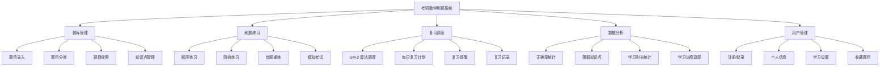

# Agent 对话记录 — 需求获取

## 第 1 轮：选题确认与初步描述

**时间**：2026-06-26

**我**：我要做一个考研数学刷题系统。目标用户是准备考研的学生，尤其是考数学一/数学二/数学三的同学。核心功能是刷题练习和智能复习。解决的问题是传统刷题没有计划性、错题难管理、不知道薄弱点在哪。技术栈初步想法是前端用 React + Vite，后端用 Node.js + Express，数据库用 SQLite。

**Agent**：这是一个很好的选题！考研数学刷题需求确实很强。我来帮你梳理一下初步的想法。

**项目的核心价值定位**：
- 相比纸质习题集：自动错题收集、智能复习调度
- 相比现有 App（如考研帮）：更专注刷题体验，提供间隔重复算法

**建议你明确以下几个问题**：
1. 题库来源是怎样的？管理员手动录入，还是有批量导入机制？
2. 需要支持哪些题型？选择题、填空题、解答题？
3. 复习算法有偏好吗？SM-2 是比较成熟的间隔重复算法
4. 需要数据分析功能吗？比如正确率趋势、薄弱知识点识别

**我**：
1. 题库先由管理员手动录入，后续考虑批量导入（JSON/CSV）
2. 支持选择题、填空题、解答题三种题型
3. SM-2 算法很好，我听说过 Anki，就用这个
4. 需要数据分析，我要看到自己的学习趋势和薄弱点

**Agent**：好的，项目轮廓已经比较清晰了。确认一下核心痛点是否覆盖全面：
- ✅ 刷题无计划 → 复习调度模块解决
- ✅ 错题难管理 → 错题重练功能解决
- ✅ 薄弱点不清晰 → 数据分析模块解决
- ✅ 刷完就忘 → SM-2 间隔重复解决

建议补充一个功能：**模拟考试模式**，让学生可以定时定量做套卷，这是考研备考的刚需。

---

## 第 2 轮：功能需求挖掘

**时间**：2026-06-26

**我**：请帮我分析考研数学刷题系统需要哪些功能模块。我初步想到的有：题库管理、刷题练习、复习调度、数据分析、用户管理。请帮我检查有没有遗漏，并给出功能模块的层级划分。

**Agent**：你的 5 大模块划分很合理。我来补充几个容易被忽略的子功能和建议：

**题库管理** - 建议补充：
- 题目难度分级（易/中/难）
- 题目标签系统（不仅限于知识点，还可以加标签如"高频考点"、"易错题"）

**刷题练习** - 建议补充：
- 做题模式：建议区分"练习模式"（不限时，做一题看一题答案）和"考试模式"（限时，全部做完才出分）
- 答题卡功能：考试模式下展示答题卡，方便跳题

**复习调度** - 这里有一些细节：
- SM-2 算法需要用户自评回忆质量（0-5 分），这一点要设计好交互
- 每天的复习上限需要可配置，避免一天堆积太多

**数据分析** - 建议再补充：
- 学习进度追踪：展示了完成了大纲的百分之多少
- 学习时长统计：每日/每周学习时长折线图

**遗漏考虑的功能**：
1. **知识点管理**：需要有一个知识点树形结构的管理功能
2. **大纲同步**：建议按考研数学最新大纲组织知识点
3. **收藏功能**：学生可以收藏好题/典型题
4. **笔记功能**：每道题可以记笔记，方便回顾

**我**：笔记功能暂时不做，保持 MVP 精简。收藏功能可以放到第二期。知识点树形结构管理确实需要，归到题库管理模块下。帮我按我说的这些整理成功能分解图吧。

**Agent**：好的，下面是用 Mermaid 语法生成的功能分解图，共三层结构：



建议 MVP 第一期只做：B1, B2, C1, C3, D1, D2, E1, E2, F1

---

## 第 3 轮：用户角色分析

**时间**：2026-06-26

**我**：这个系统有哪些类型的用户？每种用户的核心操作是什么？不同角色之间的权限有什么区别？

**Agent**：

### 用户角色分析

| 角色 | 数量级 | 核心操作 | 权限级别 |
|------|--------|---------|---------|
| 学生 | 大量 | 刷题、复习、查看数据 | 低（仅操作自己的数据） |
| 管理员 | 1-2 人 | 管理题库、管理用户 | 高（可操作所有数据） |

### 学生核心操作
1. 注册/登录账号
2. 选择练习模式进行刷题
3. 执行每日复习计划
4. 查看个人学习数据分析
5. 参与模拟考试
6. 管理个人设置

### 管理员核心操作
1. 录入/编辑/删除题目
2. 管理知识点树形结构
3. 查看注册用户列表
4. 查看系统使用统计数据
5. 批量导入/导出题目

### 权限矩阵

| 功能 | 学生 | 管理员 |
|------|:----:|:------:|
| 刷题练习 | ✅ | ✅ |
| 查看个人数据 | ✅ | ❌ |
| 查看其他用户数据 | ❌ | ✅ |
| 管理题目 | ❌ | ✅ |
| 管理用户 | ❌ | ✅ |
| 修改系统配置 | ❌ | ✅ |

**我**：清楚了，帮我确认一下，管理员如果也要刷题练习的话，他应该用自己的学生账号还是和 admin 账号合一？

**Agent**：建议合一。管理员本身可能也是学生（比如你是开发者也是使用者），所以可以给管理员账号同时拥有学生权限，一个账号两种角色。技术上可以加一个 `role` 字段（`student` / `admin`），admin 继承 student 的所有权限。

---

## 第 4 轮：非功能需求

**时间**：2026-06-26

**我**：这个系统有哪些非功能需求？请从性能、安全、可用性、兼容性等维度帮我分析。

**Agent**：

### 性能
- **加载速度**：首屏加载 < 2 秒。Vite 打包 + 代码分割，确保核心页面快速加载
- **API 响应**：平均 < 500ms。SQLite 查询优化，建立合适的索引
- **并发**：因为是个人/小团队使用，暂按 100 并发设计

### 安全
- **密码**：bcrypt 加盐哈希，绝不存明文
- **认证**：JWT Token，24 小时过期，需续期机制
- **API 鉴权**：每个接口校验 Token + 角色权限
- **防注入**：参数化查询

### 可用性
- **操作反馈**：所有操作 500ms 内给出反馈（按钮 loading、toast 提示）
- **错误友好**：不抛技术栈错误，显示"网络异常，请稍后重试"等
- **答题防丢失**：答题过程中刷新或关闭浏览器不丢进度

### 兼容性
- **浏览器**：Chrome 90+、Firefox 88+、Edge 90+
- **设备**：优先桌面，支持平板（1024px 以上）
- **屏幕**：最低支持 1024×768

**我**：并发量这里，作为个人项目 100 并发合理吗？需要再高吗？

**Agent**：完全合理。对于课程项目的规模来说：
- 100 并发 ≈ 能支撑几百个活跃用户
- SQLite 在 100 并发读场景下表现良好，写操作需要 WAL 模式
- 如果后续真有大规模需求，可以升级到 PostgreSQL

不需要再高了，选 100 既现实又有余量。建议在文档中标注"参考指标"即可。

---

## 第 5 轮：约束条件

**时间**：2026-06-26

**我**：这个项目有哪些技术约束和业务约束？比如必须用什么技术栈、不能用什么、有什么合规要求？

**Agent**：

### 技术约束
| 约束 | 说明 |
|------|------|
| 前端 | 必须用 React + Vite |
| 后端 | Node.js + Express |
| 数据库 | SQLite（零配置，适合个人项目） |
| 无付费服务 | 用免费/开源方案（LLM API 除外） |
| 代码托管 | GitHub |

### 业务约束
- 题目内容须为考研数学真题或高质量模拟题
- 不涉及用户社交功能
- 系统不做教学内容讲解，专注练习和复习

**我**：好的，都清楚了。还有一个问题——SM-2 算法需要用户自评回忆质量，这个交互怎么做比较好？

**Agent**：很好的问题！SM-2 的 0-5 评分可以简化设计为 5 个按钮：

```
[完全忘记] [困难] [犹豫] [轻松] [完美]
```

对应 SM-2 的 0-4 分（留出 5 分表示"完美回忆"可以让算法表现更好）。

交互流程：看完题目 → 用户回忆（看答案前自评） → 看答案确认 → 提交评分 → 算法更新

这样既保证了 SM-2 算法的数据质量，体验也自然。

**我**：好的，感谢，信息足够了，我来整理成文档。

---

## 第 5 轮：需求评审

**时间**：2026-06-26

**我**：请以第三方评审者的视角，审查以下需求文档。重点检查：
1. 是否有遗漏的功能需求？
2. 非功能需求是否可量化、可验证？
3. 用例描述是否有歧义？
4. 需求之间是否有冲突？
5. MVP 范围是否合理？

[粘贴需求文档]

**Agent**：我以第三方评审者视角审查了你的需求文档，发现以下 6 个问题：

### 问题 1：[高] 复习调度中"跳过"题目处理策略未定义
- **位置**：UC-002 复习用例
- **描述**：用户在复习时可能想跳过某些题目，但文档没有定义"跳过"行为
- **影响**：如果跳过策略不明确，可能导致 SM-2 调度数据混乱
- **建议**：补充跳过处理逻辑——跳过不更新 SM-2 参数，将该题延迟到后续复习队列

### 问题 2：[中] 并发用户数缺少标准配置说明
- **位置**：4.1 性能需求
- **描述**："支持 100 用户同时在线"——需要说明是什么配置下的 100 用户
- **建议**：标注"标准配置：2 核 4G 云服务器"或"单机 SQLite WAL 模式"

### 问题 3：[中] 解答题手写输入方案未定义
- **位置**：功能需求
- **描述**：解答题在电脑上作答需要公式编辑器吗？MathJax/KaTeX 支持？
- **影响**：如果解答题需要输入大量数学公式，纯文本输入体验很差
- **建议**：明确解答题的输入方案，建议支持 KaTeX 公式编辑或拍照上传答案

### 问题 4：[低] 数据不足时用户体验需优化
- **位置**：UC-003 数据分析
- **描述**：用户刚注册时没有答题记录，进入数据分析页面会看到空白
- **建议**：补充数据不足时的引导提示，引导用户去刷题

### 问题 5：[高] SM-2 质量评分等级未明确定义
- **位置**：UC-002 复习用例
- **描述**：只说了"自评质量 5 级"，但没有定义每个等级的含义
- **影响**：不同用户对同一等级的理解可能不同，导致算法效果差异
- **建议**：明确定义 5 个等级的文字描述

### 问题 6：[低] 缺少管理员管理用户的用例
- **位置**：3.3 核心用例
- **描述**：参与者列表中有管理员，但核心用例中没有管理员相关的用例描述
- **建议**：至少补充一个管理员用例，或在参与者列表中说明管理功能通过后台管理界面完成

**我**：问题 1 和问题 5 确实重要，我来修改。问题 3 我决定解答题暂时不实现，放到后续版本。问题 4 和问题 6 我也一起修复。

**Agent**：好的，修改建议：
1. UC-002 扩展流程补充跳过逻辑：不更新 SM-2 参数，1 小时后重回队列
2. UC-002 基本流程第 8 步明确 5 级评分标准的文字描述
3. 解答题方案标记为"待讨论"
4. UC-003 补充数据不足时的引导提示
5. 参与者列表补充管理员描述

**我**：已修改完成，需求文档现在更加完整了。
