# 功能分解图

## Mermaid 代码

```mermaid
graph TD
    A["考研数学刷题系统"] --> B["题库管理"]
    A --> C["刷题练习"]
    A --> D["复习调度"]
    A --> E["数据分析"]
    A --> F["用户管理"]

    B --> B1["题目录入"]
    B1 --> B1a["选择题录入"]
    B1 --> B1b["填空题录入"]
    B1 --> B1c["解答题录入"]
    B --> B2["题目分类"]
    B2 --> B2a["按章节分类"]
    B2 --> B2b["按难度分类"]
    B --> B3["题目搜索"]
    B3 --> B3a["按关键词搜索"]
    B3 --> B3b["按知识点筛选"]
    B --> B4["知识点管理"]
    B4 --> B4a["知识点树维护"]
    B4 --> B4b["知识点-题目关联"]

    C --> C1["顺序练习"]
    C1 --> C1a["按知识点顺序"]
    C1 --> C1b["答题卡导航"]
    C --> C2["随机练习"]
    C2 --> C2a["范围选择"]
    C2 --> C2b["随机抽题"]
    C --> C3["错题重练"]
    C3 --> C3a["错题列表"]
    C3 --> C3b["按知识点筛选错题"]
    C3 --> C3c["清除已掌握错题"]
    C --> C4["模拟考试"]
    C4 --> C4a["试卷组卷"]
    C4 --> C4b["限时答题"]
    C4 --> C4c["自动评分"]

    D --> D1["SM-2 算法调度"]
    D1 --> D1a["质量评分采集"]
    D1 --> D1b["间隔计算"]
    D1 --> D1c["下次复习日期"]
    D --> D2["每日复习计划"]
    D2 --> D2a["生成今日复习列表"]
    D2 --> D2b["按优先级排序"]
    D --> D3["复习提醒"]
    D3 --> D3a["浏览器通知"]
    D3 --> D3b["邮件提醒"]
    D --> D4["复习记录"]
    D4 --> D4a["复习历史查询"]
    D4 --> D4b["复习统计"]

    E --> E1["正确率统计"]
    E1 --> E1a["总体正确率"]
    E1 --> E1b["按知识点正确率"]
    E1 --> E1c["正确率趋势图"]
    E --> E2["薄弱知识点"]
    E2 --> E2a["自动识别薄弱点"]
    E2 --> E2b["薄弱报告生成"]
    E2 --> E2c["专项训练入口"]
    E --> E3["学习时长统计"]
    E3 --> E3a["日/周/月统计"]
    E3 --> E3b["学习时长趋势"]
    E --> E4["学习进度追踪"]
    E4 --> E4a["大纲完成度"]
    E4 --> E4b["未开始/进行中/已完成"]

    F --> F1["注册/登录"]
    F1 --> F1a["邮箱注册"]
    F1 --> F1b["密码登录"]
    F1 --> F1c["JWT 鉴权"]
    F --> F2["个人信息"]
    F2 --> F2a["修改昵称"]
    F2 --> F2b["修改密码"]
    F --> F3["学习设置"]
    F3 --> F3a["每日复习上限"]
    F3 --> F3b["提醒时间设置"]

    classDef main fill:#6366f1,color:#fff;
    classDef module fill:#8b5cf6,color:#fff;
    classDef mvp fill:#a78bfa,color:#fff;

    class A main;
    class B,C,D,E,F module;
    class B1,B2,C1,C3,D1,D2,E1,E2,F1 mvp;
```

> **图例**：深紫色节点 = 一级模块 | 浅紫色节点 = MVP 功能

## 功能分解说明

| 层级 | 说明 |
|:----:|------|
| 第 1 层 | 系统 = 考研数学刷题系统 |
| 第 2 层 | 5 大模块：题库管理、刷题练习、复习调度、数据分析、用户管理 |
| 第 3 层 | 各模块下的子功能，共 20+ 个子功能 |
| 第 4 层 | 子功能的进一步细化，用于指导开发实现 |

## MVP 标注

以下为第一期（MVP）需实现的功能，以 💎 标记：

| 编号 | 功能名称 | 所属模块 | 优先级 | 说明 |
|:----:|---------|---------|:------:|------|
| B1 | 题目录入 | 题库管理 | P0 | 选择题、填空题录入，关联知识点 |
| B2 | 题目分类 | 题库管理 | P0 | 按章节分类、按难度分级 |
| C1 | 顺序练习 | 刷题练习 | P0 | 按知识点顺序做题，做一题看一题 |
| C3 | 错题重练 | 刷题练习 | P0 | 自动收集错题，支持按知识点筛选重练 |
| D1 | SM-2 算法调度 | 复习调度 | P0 | 根据答题质量动态计算下次复习时间 |
| D2 | 每日复习计划 | 复习调度 | P0 | 自动生成今日待复习题目列表 |
| E1 | 正确率统计 | 数据分析 | P0 | 按知识点/时间维度统计，折线图展示趋势 |
| E2 | 薄弱知识点 | 数据分析 | P0 | 自动识别正确率 < 60% 的知识点 |
| F1 | 注册/登录 | 用户管理 | P0 | 邮箱注册 + 密码登录，JWT 鉴权 |

> **非 MVP 功能**（第二、三期实现）：随机练习、模拟考试、学习时长统计、学习进度追踪、题目搜索、复习提醒、个人信息设置、题目批量导入/导出
