# 考研数学刷题系统 需求规格说明书

## 1. 项目概述

### 1.1 项目背景
考研数学是研究生入学考试中难度最高、区分度最大的科目之一。传统的备考方式依赖纸质习题集和错题本，存在以下痛点：
- **刷题无计划**：学生不知道每天该刷什么、刷多少
- **错题难管理**：错题分散在各处，难以系统回顾
- **薄弱点不清晰**：缺乏对知识掌握度的量化分析
- **复习间隔不合理**：要么刷完就忘，要么反复刷已掌握的内容

本项目旨在构建一个智能化的考研数学刷题系统，利用间隔重复算法和数据分析技术，帮助学生高效备考。

### 1.2 项目目标
- 提供完整的题库管理和刷题功能
- 基于 SM-2 间隔重复算法，智能调度复习计划
- 提供多维度的学习数据分析与可视化
- 实现薄弱知识点自动识别与针对性训练

### 1.3 目标用户
| 用户角色 | 描述 | 核心需求 |
|---------|------|---------|
| 普通用户（学生） | 考研备考学生 | 刷题、复习、查看学习数据 |
| 管理员 | 系统维护者 | 管理题库、查看系统数据 |

### 1.4 技术约束
| 维度 | 约束 |
|------|------|
| 前端框架 | React (Vite) |
| 后端框架 | Node.js + Express |
| 数据库 | SQLite (轻量级，适合单机/小规模部署) |
| 部署方式 | 前后端分离，静态部署 + API 服务 |
| 浏览器兼容 | 支持 Chrome/Firefox/Edge 最新版本 |
| 响应式设计 | 优先桌面端，适配平板 |

## 2. 功能需求

### 2.1 功能模块总览

```mermaid
graph TD
    A["考研数学刷题系统"] --> B["题库管理"]
    A --> C["刷题练习"]
    A --> D["复习调度"]
    A --> E["数据分析"]
    A --> F["用户管理"]

    B --> B1["题目录入"]
    B1 --> B1a["选择题录入"]
    B1 --> B1b["填空题录入"]
    B1 --> B1c["解答题录入"]
    B --> B2["题目分类"]
    B2 --> B2a["按章节分类"]
    B2 --> B2b["按难度分类"]
    B --> B3["题目搜索"]
    B3 --> B3a["按关键词搜索"]
    B3 --> B3b["按知识点筛选"]
    B --> B4["知识点管理"]
    B4 --> B4a["知识点树维护"]
    B4 --> B4b["知识点-题目关联"]

    C --> C1["顺序练习"]
    C1 --> C1a["按知识点顺序"]
    C1 --> C1b["答题卡导航"]
    C --> C2["随机练习"]
    C2 --> C2a["范围选择"]
    C2 --> C2b["随机抽题"]
    C --> C3["错题重练"]
    C3 --> C3a["错题列表"]
    C3 --> C3b["按知识点筛选错题"]
    C3 --> C3c["清除已掌握错题"]
    C --> C4["模拟考试"]
    C4 --> C4a["试卷组卷"]
    C4 --> C4b["限时答题"]
    C4 --> C4c["自动评分"]

    D --> D1["SM-2 算法调度"]
    D1 --> D1a["质量评分采集"]
    D1 --> D1b["间隔计算"]
    D1 --> D1c["下次复习日期"]
    D --> D2["每日复习计划"]
    D2 --> D2a["生成今日复习列表"]
    D2 --> D2b["按优先级排序"]
    D --> D3["复习提醒"]
    D3 --> D3a["浏览器通知"]
    D3 --> D3b["邮件提醒"]
    D --> D4["复习记录"]
    D4 --> D4a["复习历史查询"]
    D4 --> D4b["复习统计"]

    E --> E1["正确率统计"]
    E1 --> E1a["总体正确率"]
    E1 --> E1b["按知识点正确率"]
    E1 --> E1c["正确率趋势图"]
    E --> E2["薄弱知识点"]
    E2 --> E2a["自动识别薄弱点"]
    E2 --> E2b["薄弱报告生成"]
    E2 --> E2c["专项训练入口"]
    E --> E3["学习时长统计"]
    E3 --> E3a["日/周/月统计"]
    E3 --> E3b["学习时长趋势"]
    E --> E4["学习进度追踪"]
    E4 --> E4a["大纲完成度"]
    E4 --> E4b["未开始/进行中/已完成"]

    F --> F1["注册/登录"]
    F1 --> F1a["邮箱注册"]
    F1 --> F1b["密码登录"]
    F1 --> F1c["JWT 鉴权"]
    F --> F2["个人信息"]
    F2 --> F2a["修改昵称"]
    F2 --> F2b["修改密码"]
    F --> F3["学习设置"]
    F3 --> F3a["每日复习上限"]
    F3 --> F3b["提醒时间设置"]

    classDef main fill:#6366f1,color:#fff;
    classDef module fill:#8b5cf6,color:#fff;
    classDef mvp fill:#a78bfa,color:#fff;

    class A main;
    class B,C,D,E,F module;
    class B1,B2,C1,C3,D1,D2,E1,E2,F1 mvp;
```



> **MVP 标注**：B1, B2, C1, C3, D1, D2, E1, E2, F1 为第一期必须实现的 MVP 功能。

### 2.2 模块详细说明

#### 模块一：题库管理

| 功能 | 描述 | MVP |
|------|------|:---:|
| 题目录入 | 管理员可手动录入题目，支持选择题、填空题、解答题三种题型。每道题需关联知识点标签、难度等级（易/中/难）、答案解析 | ✅ |
| 题目分类 | 按考研数学大纲分类：高等数学、线性代数、概率论与数理统计；每类下细分章节 | ✅ |
| 题目搜索 | 支持按知识点、难度、题型、关键词搜索题目 | |
| 题目导入/导出 | 支持通过 JSON/CSV 格式批量导入导出题目 | |

#### 模块二：刷题练习

| 功能 | 描述 | MVP |
|------|------|:---:|
| 顺序练习 | 按知识点顺序依次做题，适合系统性学习阶段 | ✅ |
| 随机练习 | 从指定知识点范围内随机抽题，适合自测阶段 | |
| 错题重练 | 自动收集做错的题目，支持按知识点筛选重练 | ✅ |
| 模拟考试 | 定时定量组卷模拟真实考试环境，自动计时计分 | |

#### 模块三：复习调度

| 功能 | 描述 | MVP |
|------|------|:---:|
| SM-2 算法调度 | 基于 SM-2 间隔重复算法，根据每次答题的正确率、回忆难度动态计算下次复习时间 | ✅ |
| 每日复习计划 | 系统自动生成每日待复习题目列表 | ✅ |
| 复习提醒 | 可通过系统通知或邮件提醒用户按时复习 | |
| 复习记录 | 记录每次复习的结果，形成复习历史 | |

#### 模块四：数据分析

| 功能 | 描述 | MVP |
|------|------|:---:|
| 正确率统计 | 按知识点/时间维度统计答题正确率，以折线图展示趋势 | ✅ |
| 薄弱知识点 | 自动识别正确率低于 60% 的知识点，生成薄弱报告 | ✅ |
| 学习时长统计 | 统计每日/每周/每月学习时长 | |
| 学习进度追踪 | 展示大纲各章节的完成进度百分比 | |

#### 模块五：用户管理

| 功能 | 描述 | MVP |
|------|------|:---:|
| 注册/登录 | 邮箱注册 + 密码登录，支持 JWT Token 鉴权 | ✅ |
| 个人信息 | 修改昵称、密码、头像 | |
| 学习设置 | 配置每日复习题量、提醒时间等偏好 | |

## 3. 用例模型

### 3.1 参与者列表

| 参与者 | 描述 |
|--------|------|
| 学生 | 系统的主要用户，进行刷题、复习、查看数据等操作 |
| 管理员 | 负责题库维护和系统管理 |

### 3.2 用例图

```mermaid
useCaseDiagram
    actor 学生 as Student
    actor 管理员 as Admin
    Admin --|> Student : 继承所有权限

    rectangle 考研数学刷题系统 {
        usecase (注册账号) as UC1
        usecase (登录系统) as UC2
        usecase (执行刷题练习) as UC3
        usecase (执行间隔复习) as UC4
        usecase (查看学习数据) as UC5
        usecase (管理题库) as UC6
        usecase (管理知识点) as UC7
        usecase (参与模拟考试) as UC8
        usecase (管理个人设置) as UC9
        usecase (错题重练) as UC10
    }

    Student --> UC1
    Student --> UC2
    Student --> UC3
    Student --> UC4
    Student --> UC5
    Student --> UC8
    Student --> UC9
    Student --> UC10

    Admin --> UC6
    Admin --> UC7

    UC3 ..> UC5 : <<include>>
    UC10 ..> UC3 : <<extend>>
```

### 3.3 核心用例描述

#### UC-001：执行刷题练习

| 字段 | 内容 |
|------|------|
| **用例编号** | UC-001 |
| **用例名称** | 执行刷题练习 |
| **参与者** | 学生 |
| **前置条件** | 用户已登录；题库中至少存在一道题目 |
| **基本流程** | 1. 学生进入刷题页面，选择练习模式（顺序/随机/错题）<br>2. 系统从题库中按规则选取题目<br>3. 系统展示题目内容，隐去答案<br>4. 学生作答并提交答案<br>5. 系统比对答案，显示正确/错误<br>6. 系统展示答案解析<br>7. 学生对题目难度进行自评（简单/适中/困难）<br>8. 学生标记是否掌握该题<br>9. 系统记录答题结果（题目ID、答案、正误、答题时间）<br>10. 系统更新 SM-2 算法参数（正确率、回忆难度）<br>11. 系统加载下一道题，重复步骤 3-10 |
| **扩展流程** | 4a. 学生作答超时（单题超过 10 分钟未提交）<br>&emsp;4a1. 系统提示"此题已超时，请尽快作答"<br>&emsp;4a2. 5 分钟后仍未提交，自动标记为"放弃"<br>5a. 学生答案部分正确（如填空题多个空，部分填对）<br>&emsp;5a1. 系统显示部分正确，标记答对的空<br>9a. 答题记录写入失败（数据库异常）<br>&emsp;9a1. 系统缓存答题记录到本地<br>&emsp;9a2. 提示用户网络异常，数据将在恢复后同步 |
| **后置条件** | 答题记录已持久化；SM-2 调度参数已更新 |

#### UC-002：执行间隔复习

| 字段 | 内容 |
|------|------|
| **用例编号** | UC-002 |
| **用例名称** | 执行间隔复习 |
| **参与者** | 学生 |
| **前置条件** | 用户已登录；SM-2 调度表中存在待复习题目 |
| **基本流程** | 1. 学生进入复习页面<br>2. 系统从 SM-2 调度表中查询"今天需要复习"的题目列表<br>3. 系统按优先级排序（过期天数越久优先级越高）<br>4. 系统展示第一道待复习题目（仅显示题目，不显示答案）<br>5. 学生回忆并口述思路（无需完整书写）<br>6. 学生点击"查看答案"<br>7. 系统展示正确答案和解析<br>8. 学生对回忆质量进行自评（5 级：完全忘记 / 困难 / 犹豫 / 轻松 / 完美）<br>9. 系统根据质量评分更新 SM-2 参数：<br>&emsp;- 质量 < 3：重置间隔，加入明日复习队列<br>&emsp;- 质量 >= 3：按 SM-2 公式计算下次复习时间<br>10. 系统加载下一道复习题，重复步骤 4-9<br>11. 所有待复习题目完成后，显示今日复习完成页面，展示统计摘要 |
| **扩展流程** | 2a. 今日无待复习题目<br>&emsp;2a1. 系统提示"今日没有需要复习的题目，可以做些新题"<br>&emsp;2a2. 提供直接跳转到刷题页面的入口<br>5a. 用户跳过当前题目<br>&emsp;5a1. 系统将题目标记为"跳过"，不更新 SM-2 参数<br>&emsp;5a2. 该题目将在 1 小时后重新加入今日复习队列<br>9a. 自评质量 = 5（完美回忆）<br>&emsp;9a1. 系统将该题目的复习间隔加倍<br>&emsp;9a2. 该题目标记为"短期精通"，在下次调度前不再出现 |
| **后置条件** | SM-2 调度参数已更新；复习记录已持久化 |

#### UC-003：查看学习数据分析

| 字段 | 内容 |
|------|------|
| **用例编号** | UC-003 |
| **用例名称** | 查看学习数据分析 |
| **参与者** | 学生 |
| **前置条件** | 用户已登录；用户至少有 10 条答题记录 |
| **基本流程** | 1. 学生进入数据分析页面<br>2. 系统默认展示"今日概览"面板：<br>&emsp;- 今日做题数、正确数、正确率<br>&emsp;- 今日复习题数<br>&emsp;- 今日学习时长<br>3. 学生选择"正确率趋势"视图<br>4. 系统查询最近 30 天的日正确率数据<br>5. 系统渲染折线图，X 轴为日期，Y 轴为正确率（%），显示趋势线<br>6. 学生选择"薄弱知识点"视图<br>7. 系统按知识点聚合所有答题记录，计算每个知识点的综合正确率<br>8. 系统渲染雷达图或柱状图，标记正确率 < 60% 的知识点为"薄弱"<br>9. 系统列出薄弱知识点列表，每个知识点后提供"专项训练"入口按钮<br>10. 学生选择"学习进度"视图<br>11. 系统按大纲章节展示各知识点的完成进度（已做题数 / 总题数）<br>12. 系统渲染进度条列表，绿色已完成、蓝色进行中、灰色未开始 |
| **扩展流程** | 2a. 用户答题记录不足 10 条<br>&emsp;2a1. 系统显示提示："数据量不足，继续刷题后将展示分析"<br>&emsp;2a2. 显示当前已做题数的简单汇总<br>7a. 某个知识点下答题记录不足 5 条<br>&emsp;7a1. 系统标记该知识点为"数据不足"，不纳入薄弱分析<br>9a. 生点击"专项训练"按钮<br>&emsp;9a1. 系统跳转到刷题页面，过滤条件为该知识点，模式为随机练习 |
| **后置条件** | 无（数据分析为只读操作） |

## 4. 非功能需求

### 4.1 性能需求
| 需求 | 指标 |
|------|------|
| 页面加载时间 | 首屏加载 < 2 秒（3G 网络下 < 3 秒） |
| API 响应时间 | 平均响应时间 < 500ms，95% 分位 < 1 秒 |
| 并发用户数 | 支持 100 用户同时在线 |
| 答题记录写入 | 单条记录写入 < 200ms |
| 数据分析查询 | 聚合查询 < 3 秒（10 万条记录以下） |

### 4.2 安全需求
| 需求 | 说明 |
|------|------|
| 密码加密 | 用户密码使用 bcrypt 加盐哈希存储 |
| 身份认证 | 使用 JWT Token，有效期 24 小时 |
| API 鉴权 | 所有 API 接口需验证 Token 有效性 |
| 防 SQL 注入 | 所有数据库查询使用参数化查询 |
| 数据传输 | 敏感接口使用 HTTPS 传输 |

### 4.3 可用性需求
| 需求 | 说明 |
|------|------|
| 操作反馈 | 所有用户操作在 500ms 内给出视觉反馈 |
| 错误提示 | 使用友好的中文错误提示，而非技术堆栈 |
| 学习无中断 | 答题过程中浏览器刷新不丢失当前题目进度 |
| 离线容错 | 答题记录本地缓存，网络恢复后自动同步 |

### 4.4 兼容性需求
- 浏览器：Chrome 90+、Firefox 88+、Edge 90+
- 分辨率：最低 1024×768，推荐 1920×1080
- 设备：优先桌面浏览器，平板可正常使用

## 5. 约束条件

### 5.1 技术约束
- 前端必须使用 React + Vite 构建
- 后端使用 Node.js + Express
- 数据库必须使用 SQLite（无需额外安装数据库服务）
- 不得使用付费第三方服务（LLM API 除外）
- 项目代码必须托管在 GitHub 仓库

### 5.2 业务约束
- 所有题目内容必须为考研数学真实考题或高质量模拟题
- 不包含用户间社交功能（不做排行榜、社区）
- 系统不直接提供教学内容（知识点讲解），仅做练习和复习调度

## 6. MVP 范围定义

### 第一期（MVP）
- 注册/登录
- 题目录入（管理员）和分类
- 顺序练习 + 错题重练
- SM-2 间隔复习调度 + 每日复习计划
- 正确率统计 + 薄弱知识点识别

### 第二期
- 随机练习模式
- 模拟考试模式
- 学习时长统计 + 学习进度追踪
- 题目搜索

### 第三期
- 题目批量导入/导出
- 复习提醒通知
- 个人信息设置
- 管理员用户管理

## 7. 需求评审记录

### 7.1 评审发现的问题

| 编号 | 问题描述 | 严重程度 | 影响范围 | 状态 |
|:----:|---------|:--------:|---------|:----:|
| 1 | 未定义复习调度中"跳过"题目的处理策略 | 高 | UC-002 | ✅ 已修复 |
| 2 | 非功能需求中"并发用户数"未说明标准配置 | 中 | 4.1 性能需求 | ✅ 已修复 |
| 3 | 缺少解答题的手写输入方案说明 | 中 | 功能需求 | ⏸ 待讨论 |
| 4 | 用例 UC-003 第 2a 步数据不足时未给出后续建议 | 低 | UC-003 | ✅ 已修复 |
| 5 | 未明确 SM-2 算法的质量评分等级定义 | 高 | UC-002 | ✅ 已修复 |
| 6 | 缺少管理员管理用户的用例描述 | 低 | 3.3 用例模型 | ✅ 已修复 |

### 7.2 修改说明

| 问题编号 | 修改内容 | 修改位置 |
|:--------:|---------|---------|
| 1 | UC-002 扩展流程 5a 补充跳过处理逻辑：不更新 SM-2 参数，1 小时后重回今日复习队列 | UC-002 扩展流程 |
| 2 | 在性能需求中补充"100 用户"为参考指标，基于 2 核 4G 单机 SQLite WAL 模式部署 | 4.1 性能需求 |
| 3 | 暂未修改。解答题方案需进一步讨论，可能方案：KaTeX 公式输入或拍照上传。已记录到待讨论列表 | 功能需求 |
| 4 | UC-003 扩展流程 2a 补充数据不足时的提示："数据量还不多，继续刷题后将展示更详细的分析"，并提供"去刷题"引导按钮 | UC-003 扩展流程 |
| 5 | UC-002 基本流程第 8 步明确定义 5 级评分标准：完全忘记(1) / 困难(2) / 犹豫(3) / 轻松(4) / 完美(5)，每个等级附文字描述 | UC-002 基本流程 |
| 6 | 在参与者列表中补充管理员描述，并在用例图中补充管理员用例（管理题库、管理知识点） | 3.1 参与者列表 + 3.2 用例图 |

### 7.3 评审结论

- **总体评价**：需求文档结构完整，核心功能覆盖全面，MVP 范围合理
- **评审通过率**：5/6 问题已修复（83.3%），1 项待讨论
- **待解决项**：解答题输入方案需在概要设计阶段进一步讨论
- **建议**：下一阶段（概要设计）中重点考虑公式编辑器的集成方案，或先聚焦选择题和填空题的 MVP 实现
