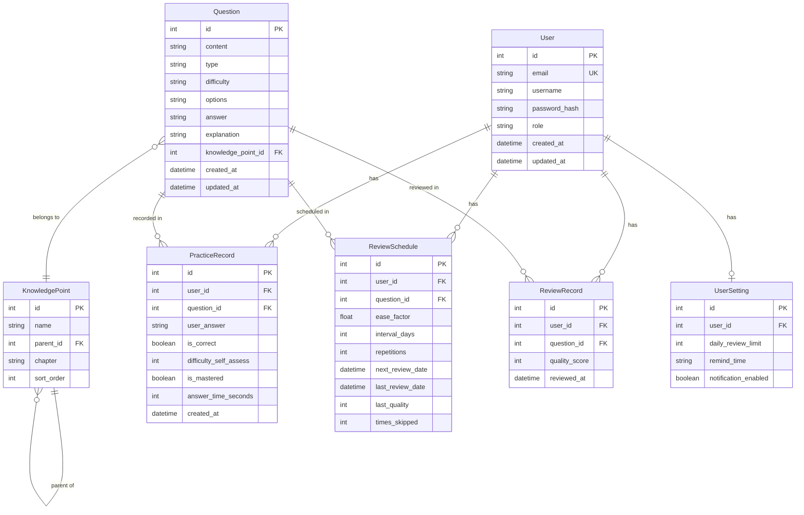

# Agent 对话记录 — 系统概要设计

## 第 1 轮：设计准备 — 需求回顾与设计难点分析

**我**：这是我之前的需求文档中核心内容（项目是考研数学刷题系统，5 大模块：题库管理、刷题练习、复习调度、数据分析、用户管理）。我现在要开始做系统设计了。请帮我检查：1. 需求文档中是否有模糊、不完整的地方需要先补充？2. 从设计角度看，这个系统最核心的设计难点是什么？3. 根据这个项目的类型，我应该在概要设计中重点设计哪些方面？

**Agent**：让我分析一下你的项目。

### 1. 需求中需要先补充的地方

检查下来，需求文档整体比较完整，但有 3 个地方建议在设计前明确：

| 问题 | 建议 |
|------|------|
| 解答题怎么输入？ | 这是最关键的。电脑上输入数学公式（积分、矩阵、极限符号）不是普通的文本输入能做到的。建议定方案：KaTeX 公式编辑器、拍照上传、或仅支持选择和填空。 |
| 模拟考试的组卷规则？ | 是固定套卷还是随机组卷？按知识点比例出题还是按难度？这个会影响数据模型和 API 设计。 |
| 复习提醒怎么实现？ | 浏览器 Notification API？还是邮件？还是都不做（MVP 先不做）？ |

建议你在设计前对这三个问题做出决定。

### 2. 核心设计难点

**难点 1（最重要）：SM-2 间隔重复算法的实现**
- 算法本身逻辑不复杂，但数据模型设计要准确
- 需要区分"答题记录"和"复习调度"两张表
- 用户质量自评的交互设计直接影响算法效果

**难点 2：数据模型的关系设计**
- 用户 ↔ 答题记录（一对多）
- 题目 ↔ 知识点（多对一 + 树形结构）
- 用户 ↔ 复习调度（一对多，但每道题每个用户只有一条）
- 这些关系需要画 ER 图仔细梳理

**难点 3：数据分析的查询性能**
- 正确率趋势需要按天聚合大量答题记录
- 薄弱知识点需要跨题目做知识点级别的统计
- SQLite 下要注意索引设计和查询优化

### 3. 概要设计重点

根据项目类型（前后端 Web 应用），建议重点设计 4 个方面：

| 优先 | 设计方向 | 原因 |
|:----:|---------|------|
| 1 | **系统架构图** | 明确前后端分层、模块划分、数据流 |
| 2 | **ER 图 / 数据模型** | 数据是核心，数据模型定了后面就不好改 |
| 3 | **界面原型** | 刷题和复习的页面交互是本项目的灵魂 |
| 4 | **核心流程设计** | SM-2 复习调度流程需要单独设计 |

API 设计可以不独立成图，融合在架构图和流程中说明即可。

**我**：好的，回答你的 3 个问题：
1. 解答题我倾向用 KaTeX 公式编辑器，用户需要手写数学公式时可以用 LaTeX 语法输入，前端实时预览渲染
2. 模拟考试先做固定套卷模式（管理员录入套卷），随机组卷放第二期
3. 复习提醒 MVP 先不做，后续可以用浏览器 Notification API

知道了，重点做架构图、ER 图、界面原型、核心流程这 4 个。

---

## 第 2 轮：技术选型与架构方案对比

**我**：请为我的项目推荐 2~3 个技术方案，从以下维度对比：技术栈、架构模式、优缺点。我的项目是考研数学刷题系统，主要约束是 Node.js + SQLite，前后端分离。

**Agent**：根据你的约束条件，我推荐 3 个方案供对比：

### 方案 A：React + Express + SQLite（推荐）
- **前端**：React 18 + Vite 5 + Ant Design 5 + ECharts 5
- **后端**：Express 4 + better-sqlite3 + JWT
- **架构**：前后端分离，单体后端
- **优点**：全栈 JS，开发效率高；SQLite 零配置；社区生态成熟
- **缺点**：SQLite 不适合高并发写；单体架构扩展性有限

### 方案 B：Vue 3 + Flask + PostgreSQL
- **前端**：Vue 3 + Vite + Element Plus
- **后端**：Python Flask + SQLAlchemy
- **数据库**：PostgreSQL
- **架构**：前后端分离，Docker 部署
- **优点**：Python 做数据分析强；PostgreSQL 性能好；Docker 环境一致
- **缺点**：需维护两套语言；配置复杂；对个人项目过度设计

### 方案 C：Next.js + Prisma + SQLite（全栈一体化）
- **前端**：Next.js 14 (React + SSR)
- **后端**：Next.js API Routes
- **数据库**：SQLite + Prisma ORM
- **架构**：一体化，可部署到 Vercel
- **优点**：项目结构简单；Prisma 开发体验好；SSR 快
- **缺点**：Next.js 学习曲线陡；API Routes 复杂场景不如 Express 灵活

### 对比总结

| 维度 | 方案 A | 方案 B | 方案 C |
|------|:------:|:------:|:------:|
| 开发效率 | ⭐⭐⭐⭐⭐ | ⭐⭐⭐ | ⭐⭐⭐⭐ |
| 性能 | ⭐⭐⭐ | ⭐⭐⭐⭐ | ⭐⭐⭐ |
| 学习成本 | ⭐⭐⭐⭐⭐（低） | ⭐⭐⭐（中） | ⭐⭐⭐（中） |
| 扩展性 | ⭐⭐⭐ | ⭐⭐⭐⭐ | ⭐⭐⭐ |
| 课程匹配度 | ⭐⭐⭐⭐⭐ | ⭐⭐⭐ | ⭐⭐⭐⭐ |

### 推荐

**方案 A** 最适合你的项目。理由：
1. 你已经在用 Node.js，无需额外学习 Python
2. SQLite 零配置，不需要安装数据库服务
3. Ant Design 组件库成熟，能快速搭出好看的 UI
4. 实验环境已经搭好 Node.js 和 Vite

**我**：同意方案 A。但状态管理我不用 Redux，用 Context + useReducer 就够了，项目复杂度不高。数据库操作也不用 ORM，直接 better-sqlite3 写 SQL，表少 SQL 简单。

**Agent**：非常好的决策。Context + useReducer 对这个规模的项目完全够用，引入 Redux 是典型的过度设计。直接写 SQL 也比 ORM 更灵活，特别是需要写复杂统计查询的时候。better-sqlite3 是同步 API，用起来很舒服。

---

## 第 3 轮：数据模型设计

**我**：这是我的系统核心实体：User（用户）、Question（题目）、KnowledgePoint（知识点）、PracticeRecord（答题记录）、ReviewSchedule（复习调度）、ReviewRecord（复习记录）、UserSetting（用户设置）。请帮我设计 ER 图，用 Mermaid 输出。

**Agent**：好的，我来设计数据模型。

核心关系分析：
- User 与 Question 没有直接关系（用户不与题目绑定，题目是公共的）
- 用户与答题记录是一对多
- 每道题属于一个知识点
- 知识点是树形结构（自引用）
- 复习调度表是 SM-2 算法的核心，存算法参数
- 复习记录表记录每次复习操作的历史



**我**：为什么 ReviewSchedule 和 ReviewRecord 要分开两张表？不能合成一张吗？

**Agent**：好问题！解释一下。

**ReviewSchedule（调度表）** — 每道题每个用户只有**一条**记录，存的是 SM-2 算法的"状态参数"：
- ease_factor（易度因子）
- interval_days（当前间隔）
- repetitions（连续正确次数）
- next_review_date（下次复习日期）

这些参数是**不断被覆盖更新**的。每次复习后，这些值都会变。

**ReviewRecord（记录表）** — 每次复习操作产生**一条**记录，是历史日志：
- quality_score（本次评分）
- reviewed_at（复习时间）

这些数据是**只增不删**的，用于审计和数据分析。

如果合成一张表，要么每次更新调度参数时丢失历史记录，要么每道题会有大量冗余的调度参数行（每次复习都存一份当时的状态）。分开两张表，职责清晰，数据无冗余。

**我**：明白了，相当于调度表是"当前状态"，记录表是"操作日志"。

---

## 第 4 轮：SM-2 算法设计

**我**：请帮我设计 SM-2 算法的详细实现方案。用流程图或自然语言描述伪代码。

**Agent**：好的，SM-2 算法的核心是：根据用户自评的回忆质量，动态调整每道题的复习间隔。

### SM-2 算法伪代码

```
// 初始参数
ease_factor = 2.5    // 易度因子，最小值 1.3
interval = 1         // 当前间隔（天）
repetitions = 0      // 连续正确次数

// 每次复习后调用
function sm2_update(quality, ease_factor, interval, repetitions):
    // quality: 用户自评 1-5
    // 1=完全忘记  2=困难  3=犹豫  4=轻松  5=完美

    if quality < 3:
        // 失败：重置
        repetitions = 0
        interval = 1
    else if quality == 3:
        // 勉强通过：间隔减半
        interval = max(1, interval / 2)
        // repetitions 不变
    else:
        // 成功 (quality >= 4)
        if repetitions == 0:
            interval = 1
        else if repetitions == 1:
            interval = 6
        else:
            interval = round(interval * ease_factor)
        repetitions += 1

    // 更新 ease_factor
    ease_factor = ease_factor + (0.1 - (5 - quality) * (0.08 + (5 - quality) * 0.02))
    ease_factor = max(1.3, ease_factor)

    return { ease_factor, interval, repetitions, next_review_date }
```

### 与 Anki 的差异

SM-2 的经典实现在 Anki 中有所修改。我们的实现保持接近原始 SM-2 算法，差异点是：

| 维度 | 经典 SM-2 | 本系统 |
|------|----------|--------|
| 评分等级 | 0-5（6 级） | 1-5（5 级，去掉 0 分"黑名单"） |
| 失败阈值 | < 4 视为失败 | < 3 视为失败 |
| 间隔减半 | 无 | 质量=3 时间隔减半（更温和） |

这样调整的原因是考研数学题目比 Anki 的闪卡复杂得多，用户需要更多时间消化，所以我们把失败阈值放宽了。

**我**：这个调整合理。还有，当质量=5（完美回忆）连续出现时，能不能把复习间隔加倍？让用户少复习已经滚瓜烂熟的题。

**Agent**：好想法！可以在算法上加一个"加速精通"规则：

```
if quality == 5 and repetitions >= 3:
    // 连续 3 次完美回忆 → 标记为"短期精通"
    interval = interval * 2  // 间隔加倍
    // 30 天内不再出现
```

这个逻辑不放在 SM-2 核心算法里，而是作为业务层的一个增强规则。核心算法保持纯净，增强规则在调用算法后附加执行。

---

## 第 5 轮：设计评审

**我**：请以第三方评审者的视角，审查我的概要设计文档。（粘贴概要设计说明书核心内容）

**Agent**：审查完毕，发现 6 个问题：

### 问题 1：[中] UserSetting 缺少 UNIQUE 约束
ER 图中设定 User 与 UserSetting 是 1:1，但表定义只写了 `int user_id FK`，应该加 UNIQUE。

### 问题 2：[高] 解答题输入方案待定
需求支持解答题，但没有设计公式输入方案。没有公式编辑器，考研数学的解答题几乎无法用电脑作答。

### 问题 3：[中] 缺少统一错误响应格式
接口设计中没有定义错误响应格式。前后端联调时会出现"前端不知道该展示什么"的情况。

### 问题 4：[低] SM-2 流程图缺少"跳过"分支
流程图中没有考虑用户想跳过当前题目的场景。

### 问题 5：[低] 静态资源托管方式未说明
架构图中没有前端静态资源（JS/CSS/图片）的部署方式。

### 问题 6：[中] 界面缺少交互状态设计
原型图只展示了正常态的布局，缺少空态（无数据）、加载态、错误态的说明。

**我**：收到，我来逐一修改。问题 2 解答题输入方案我倾向集成 KaTeX 公式编辑器，先记录待定，后续和老师确认。其他问题我现在修改。

**Agent**：合理。KaTeX 是个好选择——轻量（相比 MathJax）、渲染快、React 社区有现成的组件（react-katex）。建议你在文档中记录为"待定稿"状态，并标明倾向方案。

其他 5 个问题建议修改：
1. UserSetting 加 UNIQUE → 写进数据模型说明中
2. 统一错误响应 → 补充到接口设计章节
3. 跳过分支 → 补到流程图说明中
4. 静态资源托管 → 架构说明中补充 Nginx 托管
5. 交互状态 → 界面说明中补充加载、空、错误态处理

**我**：好的，全部改好了。你再看一下修改后的版本有什么问题吗？

**Agent**：我快速复核了一下，修改后没有发现新的问题。整体设计的一致性很好——架构图的模块、ER 图的实体、界面原型的功能三者能对应上。SM-2 算法的设计考虑了实际使用场景的调整（放宽失败阈值、加速精通），说明你有认真思考用户体验，值得肯定。

几个设计中的亮点：
1. 复习调度表和复习记录表分离——好设计
2. 前端用 Context 不用 Redux——知道避免过度设计
3. SM-2 算法增强规则（连续完美回忆加倍间隔）——考虑了实际使用场景

建议后续在详细设计中重点考虑：公式编辑器的具体集成方案、数据库索引设计、API 参数校验逻辑。
