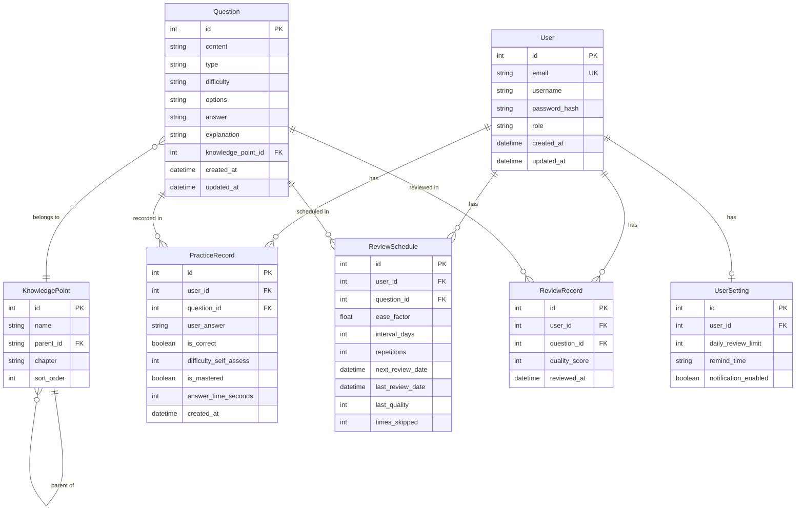
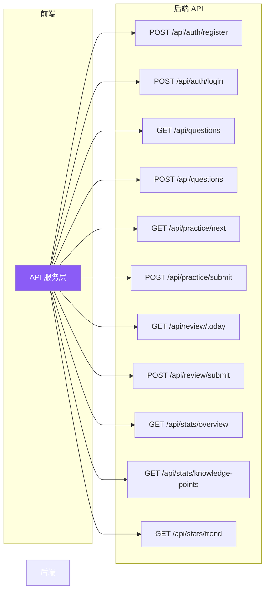
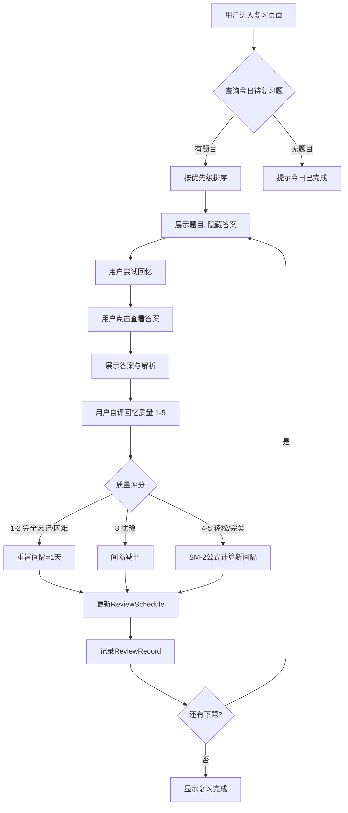
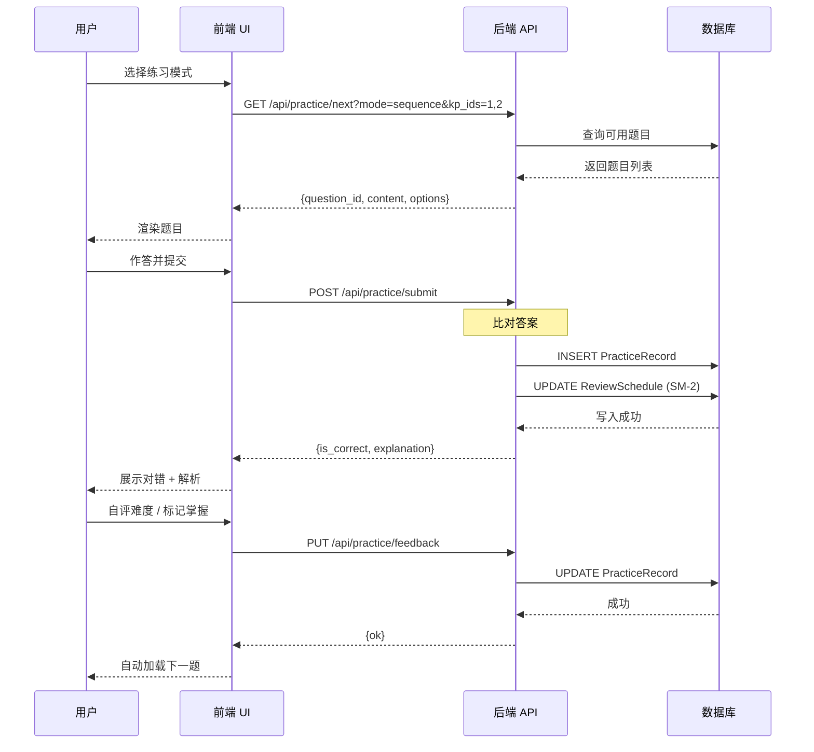

# 考研数学刷题系统 概要设计说明书

## 1. 设计概述

### 1.1 设计目标
- 将需求规格说明书中的功能需求映射为具体的系统架构和模块设计
- 确定技术栈和整体架构方案，保证系统的可扩展性和可维护性
- 完成数据模型设计，覆盖核心业务实体及其关系
- 产出界面原型，明确用户操作流程
- 明确核心业务流程，指导后续详细设计和编码实现

### 1.2 设计范围
本概要设计覆盖需求规格说明书中的所有功能模块：
- 题库管理（题目录入、分类、搜索）
- 刷题练习（顺序练习、随机练习、错题重练、模拟考试）
- 复习调度（SM-2 算法调度、每日复习计划、复习提醒、复习记录）
- 数据分析（正确率统计、薄弱知识点、学习时长、学习进度）
- 用户管理（注册/登录、个人信息、学习设置）

以及所有非功能需求（性能、安全、可用性、兼容性）。

### 1.3 设计约束
| 约束类型 | 内容 |
|---------|------|
| 技术约束 | 前端 React + Vite，后端 Node.js + Express，数据库 SQLite |
| 平台约束 | 优先桌面端 Chrome/Firefox/Edge，适配平板 |
| 时间约束 | 4 课时内完成概要设计，后续 4 次实验完成编码实现 |
| 部署约束 | 前后端分离，可部署于单台云服务器或本地运行 |

## 2. 技术选型

### 2.1 技术栈总览

| 层级 | 技术选型 | 版本 |
|------|---------|:----:|
| 前端框架 | React | 18.x |
| 前端构建工具 | Vite | 5.x |
| UI 组件库 | Ant Design | 5.x |
| 图表库 | ECharts | 5.x |
| 路由 | React Router | 6.x |
| 状态管理 | React Context + useReducer | — |
| HTTP 客户端 | Axios | 1.x |
| 后端框架 | Express | 4.x |
| 认证 | JWT (jsonwebtoken) | 9.x |
| 密码加密 | bcryptjs | 2.x |
| 数据库 | SQLite (better-sqlite3) | 11.x |
| 日志 | morgan | 1.x |
| 跨域 | cors | 2.x |

### 2.2 方案对比

#### 方案 A：React + Express + SQLite（选定方案）

| 维度 | 说明 |
|------|------|
| 前端 | React + Vite + Ant Design |
| 后端 | Node.js + Express |
| 数据库 | SQLite (better-sqlite3) |
| 部署 | 前后端分离，Nginx 代理静态文件 + API |
| 优势 | 技术栈统一（全栈 JS），开发效率高；SQLite 零配置，适合个人项目；社区资源丰富，学习成本低 |
| 劣势 | SQLite 不适合高并发写场景；没有微服务扩展能力 |

#### 方案 B：Vue + Flask + PostgreSQL

| 维度 | 说明 |
|------|------|
| 前端 | Vue 3 + Vite + Element Plus |
| 后端 | Python Flask |
| 数据库 | PostgreSQL |
| 部署 | Docker Compose |
| 优势 | Python 数据分析和 AI 集成方便；PostgreSQL 性能强劲，功能丰富；Docker 部署标准化 |
| 劣势 | 需要同时掌握 JS 和 Python；开发环境配置复杂；对于个人项目过度设计 |

#### 方案 C：Next.js + Prisma + SQLite（全栈一体化）

| 维度 | 说明 |
|------|------|
| 前端 | Next.js (React + SSR) |
| 后端 | Next.js API Routes |
| 数据库 | SQLite + Prisma ORM |
| 部署 | Vercel / 自部署 |
| 优势 | 前后端一体化，项目结构简单；Prisma ORM 开发体验优秀；SSR 有利于首屏加载速度 |
| 劣势 | Next.js 学习曲线较陡；API Routes 在复杂场景下不如 Express 灵活；不适合重后端逻辑的应用 |

### 2.3 最终选择与理由

**选定方案 A：React + Express + SQLite**

理由：
1. **团队技术匹配**：JS 全栈，前后端用同一门语言，减少上下文切换成本
2. **项目规模适配**：个人项目，用户量小，SQLite 完全够用且无需额外安装数据库服务
3. **开发效率**：Vite 极速热更新，Express 轻量灵活，适合快速迭代
4. **课程要求**：满足实验环境中 Node.js 已安装的前提条件
5. **MVP 导向**：简单技术栈意味着更少的天坑，更大概率按时交付

放弃方案 B 的原因：Python + PostgreSQL 对于刷题系统来说过于重量级，且需要同时维护两套技术栈。

放弃方案 C 的原因：SSR 对本项目收益不大（题库管理不需要 SEO），Express 在 API 设计上更灵活。

## 3. 系统架构

### 3.1 架构图

```mermaid
flowchart TB
    subgraph 客户端层
        Browser[浏览器]
    end

    subgraph 前端层 [前端 - React SPA]
        Router[React Router]
        Pages[页面组件]
        Components[通用组件]
        Context[状态管理 Context]
        Service[API 服务层 Axios]
    end

    subgraph 后端层 [后端 - Express API Server]
        Middleware[中间件层]
        Middleware --> Auth[JWT 鉴权]
        Middleware --> Logger[请求日志]
        Middleware --> Cors[CORS]
        Middleware --> ErrorHandler[错误处理]

        Routes[路由层]
        Routes --> UserRoutes[用户路由]
        Routes --> QuestionRoutes[题目路由]
        Routes --> PracticeRoutes[练习路由]
        Routes --> ReviewRoutes[复习路由]
        Routes --> StatsRoutes[统计路由]

        ServiceLayer[服务层]
        ServiceLayer --> UserService[用户服务]
        ServiceLayer --> QuestionService[题目服务]
        ServiceLayer --> PracticeService[练习服务]
        ServiceLayer --> ReviewService[复习服务 - SM2]
        ServiceLayer --> StatsService[统计服务]
    end

    subgraph 数据层
        SQLite[(SQLite 数据库)]
        SM2Memory[SM-2 调度内存计算]
    end

    Browser -->|HTTP/HTTPS| Router
    Service -->|Axios API 调用| Middleware
    Routes --> ServiceLayer
    ServiceLayer --> SQLite
    ReviewService --> SM2Memory

    style 客户端层 fill:#1a1a2e,stroke:#6366f1
    style 前端层 fill:#16213e,stroke:#8b5cf6
    style 后端层 fill:#1a1a2e,stroke:#8b5cf6
    style 数据层 fill:#16213e,stroke:#a78bfa
```



### 3.2 架构说明

#### 分层职责

| 层 | 职责 | 关键设计决策 |
|----|------|------------|
| **前端 SPA** | UI 渲染、用户交互、客户端路由 | 单页应用，所有页面由 React Router 控制；API 请求统一通过 Axios 实例，附带 JWT Token |
| **后端 API** | 业务逻辑处理、数据持久化、认证鉴权 | RESTful API 设计；中间件链式处理请求；服务层封装核心业务逻辑 |
| **数据层** | 数据存储与查询 | SQLite 通过 better-sqlite3 同步操作（避免回调地狱）；SM-2 调度参数在后端内存中计算后写入数据库 |

#### 数据流

```
用户操作 → 前端页面 → API 服务层 (Axios) → HTTP 请求 → 后端中间件 → 路由 → 服务层 → 数据库
                                                                                         ↓
用户界面 ← 前端渲染 ← API 响应 ← HTTP 响应 ← 路由返回 ← 服务层返回 ← 数据库查询结果
```

#### 关键设计决策

1. **为什么后端不直接用 ORM？** 项目数据模型简单（5-6 个核心表），直接写 SQL 比引入 ORM 更轻量、更可控。better-sqlite3 是同步 API，代码更简洁。
2. **为什么状态管理只用 Context 不用 Redux？** 项目状态复杂度低（主要是用户登录态和当前做题状态），Context + useReducer 足够，引入 Redux 增加不必要复杂度。
3. **SM-2 算法放在后端而非前端？** 调度计算逻辑是系统核心，放在后端保证数据一致性；前端只负责展示和收集用户评分。

#### 局限性 & 后续改进

- 当前架构为单体后端，如果未来用户量增长，可拆分为微服务（题库服务、复习服务、分析服务）
- SQLite 的写锁在并发用户超过 50 时可能成为瓶颈，届时可迁移至 PostgreSQL
- 前端未做 SSR，首屏加载时间受限于 JS 包大小，后续可引入代码分割和懒加载优化

## 4. 数据设计

### 4.1 ER 图 / 数据模型图



### 4.2 核心实体说明

#### User（用户）

| 字段 | 类型 | 说明 |
|------|------|------|
| id | INTEGER PK | 自增主键 |
| email | TEXT UK | 登录邮箱 |
| username | TEXT | 显示昵称 |
| password_hash | TEXT | bcrypt 哈希值 |
| role | TEXT | `student` / `admin` |
| created_at | DATETIME | 注册时间 |

设计说明：role 字段支持学生和管理员两种角色，管理员继承学生全部权限。不设独立的 Role 表，角色逻辑简单，用字符串字段即可。

#### Question（题目）

| 字段 | 类型 | 说明 |
|------|------|------|
| id | INTEGER PK | 自增主键 |
| content | TEXT | 题目内容（支持 Markdown / KaTeX 公式） |
| type | TEXT | `choice` / `fill` / `essay` |
| difficulty | TEXT | `easy` / `medium` / `hard` |
| options | TEXT | 选择题选项（JSON 数组） |
| answer | TEXT | 正确答案 |
| explanation | TEXT | 答案解析 |
| knowledge_point_id | INTEGER FK | 关联知识点 |

设计说明：选择题选项存为 JSON 字符串（如 `["A. 1", "B. 2", "C. 3", "D. 4"]`），格式简单且前端直接可用。题目内容支持 KaTeX 公式语法，前端通过 KaTeX 库渲染。

#### KnowledgePoint（知识点）

| 字段 | 类型 | 说明 |
|------|------|------|
| id | INTEGER PK | 自增主键 |
| name | TEXT | 知识点名称，如"极限与连续" |
| parent_id | INTEGER FK | 父知识点 ID，树形结构 |
| chapter | TEXT | 所属章节，如"高等数学" |
| sort_order | INTEGER | 排序序号 |

设计说明：parent_id 自引用实现树形结构，支持多级知识点层级。根节点 parent_id 为 NULL。这种设计（邻接表）查询简单，适合层级不深（< 5 层）的知识点树。

#### PracticeRecord（答题记录）

| 字段 | 类型 | 说明 |
|------|------|------|
| id | INTEGER PK | 自增主键 |
| user_id | INTEGER FK | 用户 ID |
| question_id | INTEGER FK | 题目 ID |
| user_answer | TEXT | 用户提交的答案 |
| is_correct | BOOLEAN | 是否正确 |
| difficulty_self_assess | INTEGER | 用户自评难度 1-3 |
| is_mastered | BOOLEAN | 用户标记是否掌握 |
| answer_time_seconds | INTEGER | 答题用时（秒） |
| created_at | DATETIME | 答题时间 |

设计说明：每条记录只存单次答题结果。同一道题多次作答会产生多条记录，数据分析时按时间倒序取最近记录。is_mastered 为用户主观判断，与算法计算的"掌握"不同。

#### ReviewSchedule（复习调度）

| 字段 | 类型 | 说明 |
|------|------|------|
| id | INTEGER PK | 自增主键 |
| user_id | INTEGER FK | 用户 ID |
| question_id | INTEGER FK | 题目 ID |
| ease_factor | REAL | SM-2 易度因子（初始 2.5） |
| interval_days | INTEGER | 当前复习间隔（天） |
| repetitions | INTEGER | 连续正确次数 |
| next_review_date | DATETIME | 下次复习日期 |
| last_review_date | DATETIME | 上次复习日期 |
| last_quality | INTEGER | 上次质量评分 1-5 |
| times_skipped | INTEGER | 跳过次数累计 |

设计说明：这是 SM-2 算法的核心数据表。每道题每个用户有且仅有一条调度记录。每次复习后更新 ease_factor、interval_days、repetitions 和 next_review_date。

#### ReviewRecord（复习记录）

| 字段 | 类型 | 说明 |
|------|------|------|
| id | INTEGER PK | 自增主键 |
| user_id | INTEGER FK | 用户 ID |
| question_id | INTEGER FK | 题目 ID |
| quality_score | INTEGER | SM-2 质量评分 1-5 |
| reviewed_at | DATETIME | 复习时间 |

设计说明：与 PracticeRecord 分离，专门记录复习操作。复习与刷题是两种不同的业务场景，分开表设计更清晰。

#### UserSetting（用户设置）

| 字段 | 类型 | 说明 |
|------|------|------|
| id | INTEGER PK | 自增主键 |
| user_id | INTEGER FK | 用户 ID（唯一） |
| daily_review_limit | INTEGER | 每日最大复习题数，默认 20 |
| remind_time | TEXT | 复习提醒时间，如"20:00" |
| notification_enabled | BOOLEAN | 是否开启通知 |

设计说明：用户设置与用户是一对一关系。通过 daily_review_limit 控制每日复习量，避免一天堆积太多题目。

## 5. 界面设计

### 5.1 界面原型图

#### 5.1.1 刷题页面

```
┌──────────────────────────────────────────────────────────────┐
│  🔢 考研数学刷题系统     [题库] [刷题] [复习] [数据] [设置] │
├──────────────────────────────────────────────────────────────┤
│  模式: [顺序练习 ▼]  知识点: [全部 ▼]                       │
│  进度: ████████░░░░░░░░░░ 12/30                             │
├──────────────────────────────────────────────────────────────┤
│                                                              │
│  第 13 题 / 共 30 题                                         │
│                                                              │
│  ┌──────────────────────────────────────────────────────┐    │
│  │                                                      │    │
│  │  已知函数 f(x) 在 [0,1] 上连续，在 (0,1) 内可导，    │    │
│  │  且 f(0)=0，f(1)=1。证明：存在 ξ∈(0,1)，使得        │    │
│  │  f'(ξ) = 1。                                        │    │
│  │                                                      │    │
│  │  难度：★★★☆☆                                       │    │
│  │  知识点：微分中值定理                                 │    │
│  └──────────────────────────────────────────────────────┘    │
│                                                              │
│  ┌──────────────────────────────────────────────────────┐    │
│  │  [输入你的答案...]                                    │    │
│  └──────────────────────────────────────────────────────┘    │
│                                                              │
│  [提交答案]  [跳过]  [收藏]                                  │
│                                                              │
└──────────────────────────────────────────────────────────────┘
```

#### 5.1.2 复习页面

```
┌──────────────────────────────────────────────────────────────┐
│  🔢 考研数学刷题系统     [题库] [刷题] [复习] [数据] [设置] │
├──────────────────────────────────────────────────────────────┤
│                                                              │
│  📅 今日复习计划                                     剩余: 8 │
│                                                              │
│  ┌──────────────────────────────────────────────────────┐    │
│  │  还记得这道题的解法吗？                                │    │
│  │                                                      │    │
│  │  设 A 为 3 阶矩阵，|A| = 2，求 |2A^{-1} + A*|       │    │
│  │                                                      │    │
│  │  ─── 回忆后点击查看答案 ───                            │    │
│  │                                                      │    │
│  │              [查看答案]                               │    │
│  └──────────────────────────────────────────────────────┘    │
│                                                              │
│  自评回忆质量：                                              │
│  [完全忘记] [困难] [犹豫] [轻松] [完美]                      │
│                                                              │
└──────────────────────────────────────────────────────────────┘
```

#### 5.1.3 数据分析页面

```
┌──────────────────────────────────────────────────────────────┐
│  🔢 考研数学刷题系统     [题库] [刷题] [复习] [数据] [设置] │
├──────────────────────────────────────────────────────────────┤
│  今日概览                                                     │
│  ┌──────┐  ┌──────┐  ┌──────┐  ┌──────┐                     │
│  │ 做题  │  │ 正确  │  │ 正确率│  │ 学习  │                     │
│  │  24  │  │  18  │  │ 75%  │  │ 45min │                     │
│  └──────┘  └──────┘  └──────┘  └──────┘                     │
│                                                              │
│  正确率趋势 [30天 ▼]                                         │
│  ┌──────────────────────────────────────────────────────┐    │
│  │  📈  100%                                            │    │
│  │      80% ╱╲    ╱╲                                    │    │
│  │      60%╱  ╲  ╱  ╲    ╱╲                              │    │
│  │      40%╱    ╲╱    ╲  ╱  ╲                            │    │
│  │      20%              ╲╱    ╲                          │    │
│  │      0%  ──┬──┬──┬──┬──┬──┬──                        │    │
│  │          6/1  6/5  6/10  6/15  6/20  6/25             │    │
│  └──────────────────────────────────────────────────────┘    │
│                                                              │
│  薄弱知识点 [专项训练]                                        │
│  ┌──────────────────────────────────────────────────────┐    │
│  │  微分中值定理          ████████░░░░░░  42%  🟡 训练 │    │
│  │  向量组线性相关        ██████░░░░░░░░  35%  🔴 训练 │    │
│  │  概率分布函数          ██████████░░░░  55%  🟢 训练 │    │
│  └──────────────────────────────────────────────────────┘    │
└──────────────────────────────────────────────────────────────┘
```

### 5.2 界面说明

#### 5.2.1 刷题页面
- **功能**：核心学习页面，支持顺序练习、随机练习、错题重练、模拟考试四种模式
- **布局**：顶部导航栏 → 模式/筛选控制栏 → 题目展示区 → 答题输入区 → 操作按钮
- **交互流程**：
  1. 选择练习模式和知识点筛选条件
  2. 系统加载题目并展示
  3. 用户阅读题目并输入答案
  4. 点击"提交答案" → 系统即时反馈对错并展示解析
  5. 用户自评难度，标记是否掌握
  6. 自动加载下一题
- **设计说明**：答题区与解析区分开展示，避免干扰用户思考。进度条让用户了解当前练习进度。考试模式下隐藏"查看答案"按钮，全部提交后才出分。

#### 5.2.2 复习页面
- **功能**：执行 SM-2 间隔复习，查看每日复习计划
- **布局**：今日复习概况 → 待复习题目卡片 → 回忆质量自评按钮组
- **交互流程**：
  1. 系统展示今日待复习题目列表（按优先级排序）
  2. 用户展示题目，尝试回忆
  3. 点击"查看答案"后展示正确答案和解析
  4. 用户从 5 级评分中选择回忆质量
  5. 系统自动更新 SM-2 参数，加载下一题
- **设计说明**：复习页面的核心是"回忆—确认—自评"闭环。题目不要一上来就显示答案，迫使用户主动回忆。5 级评分按钮使用大按钮设计，减少点击误操作。

#### 5.2.3 数据分析页面
- **功能**：展示学习统计数据，帮助用户了解学习进展和薄弱环节
- **布局**：顶部概览卡片区 → 图表区（正确率趋势、薄弱知识点、学习进度）
- **交互流程**：用户切换不同视图查看对应数据，薄弱知识点提供"专项训练"一键跳转
- **设计说明**：今日概览放在最顶部，给用户即时反馈感。图表可交互（悬停显示数据详情）。薄弱知识点用颜色编码（红 < 40%，黄 40%-60%，绿 > 60%），一目了然。

#### 被放弃的方案及其理由
- **卡片式复习（类似 Anki）**：放弃，因为考研数学需要看到完整题目和解题过程，不适合闪卡式复习
- **侧边栏导航**：放弃，顶部导航在宽屏下更易用，且内容区域更大
- **暗色模式**：延后到第二期，MVP 阶段聚焦核心功能

## 6. 接口设计

### 6.1 接口概览图



### 6.2 主要接口说明

#### 认证接口

| 接口 | 方法 | 说明 | 请求体 | 响应 |
|------|------|------|--------|------|
| `/api/auth/register` | POST | 用户注册 | `{email, username, password}` | `{token, user}` |
| `/api/auth/login` | POST | 用户登录 | `{email, password}` | `{token, user}` |

#### 题目接口

| 接口 | 方法 | 说明 | 参数 | 响应 |
|------|------|------|------|------|
| `/api/questions` | GET | 获取题目列表（支持筛选） | `?type=&difficulty=&kp=&page=&limit=` | `{questions, total, page, limit}` |
| `/api/questions` | POST | 录入题目（管理员） | `{content, type, difficulty, options, answer, explanation, kp_id}` | `{question}` |
| `/api/questions/:id` | GET | 获取单题详情 | — | `{question}` |

#### 练习接口

| 接口 | 方法 | 说明 | 请求体/参数 | 响应 |
|------|------|------|------------|------|
| `/api/practice/next` | GET | 获取下一道练习题 | `?mode=&kp_ids=` | `{question}`（无答案） |
| `/api/practice/submit` | POST | 提交答题结果 | `{question_id, user_answer, time_seconds, difficulty_self_assess, is_mastered}` | `{is_correct, correct_answer, explanation}` |

#### 复习接口

| 接口 | 方法 | 说明 | 参数/请求体 | 响应 |
|------|------|------|-----------|------|
| `/api/review/today` | GET | 获取今日复习列表 | — | `{questions[], total, completed}` |
| `/api/review/submit` | POST | 提交复习评分 | `{question_id, quality_score}` | `{next_review_date}` |

#### 统计接口

| 接口 | 方法 | 说明 | 参数 | 响应 |
|------|------|------|------|------|
| `/api/stats/overview` | GET | 今日概览 | — | `{today_questions, today_correct, rate, today_minutes}` |
| `/api/stats/knowledge-points` | GET | 各知识点统计 | — | `{kp_stats[]}` |
| `/api/stats/trend` | GET | 正确率趋势 | `?days=30` | `{daily_stats[]}` |

#### 接口设计说明

1. **RESTful 风格**：资源使用名词复数形式，操作通过 HTTP 方法区分
2. **统一响应格式**：`{code: 200, data: {...}, message: "ok"}`
3. **认证方式**：所有接口（除 /auth 外）需要在 Header 中携带 `Authorization: Bearer <token>`
4. **错误处理**：统一错误响应格式 `{code: 4xx, message: "错误描述", details: {...}}`
5. **分页**：列表接口统一使用 `page` 和 `limit` 参数，响应中包含 `total` 字段

## 7. 核心流程设计

### 7.1 SM-2 间隔复习流程



#### 流程说明

1. **触发器**：用户点击"复习"页面或每日首次进入系统时自动检查
2. **排序策略**：过期天数越久优先级越高，同等过期天数按复习次数升序。确保长期未复习的题目优先得到处理
3. **用户自评**：必须在"查看答案"之后自评，保证评分基于真实的回忆情况
4. **算法更新**：
   - 质量 1-2（失败）：视为未掌握，间隔重置为 1 天，`repetitions` 重置为 0
   - 质量 3（犹豫）：间隔减半，`repetitions` 不变
   - 质量 4-5（成功）：按 SM-2 公式 `I(n+1) = I(n) × EF` 计算，`repetitions++`，EF 根据质量调整
5. **设计选择**：复习与刷题使用不同的数据表（ReviewSchedule vs PracticeRecord），因为两者的业务逻辑和数据结构差异较大

### 7.2 答题练习流程



## 8. 设计评审记录

### 8.1 评审发现的问题

| 编号 | 问题描述 | 严重程度 | 状态 |
|:----:|---------|:--------:|:----:|
| 1 | ER 图中 UserSetting 缺少唯一约束说明（用户与设置应为 1:1） | 中 | 已修复 |
| 2 | 未设计解答题的公式输入方案，KaTeX 渲染性能需要考虑 | 高 | 待定稿 |
| 3 | 接口设计缺少错误响应码的定义 | 中 | 已修复 |
| 4 | SM-2 流程图中缺少"跳过"题目的分支 | 低 | 已修复 |
| 5 | 架构图中未体现静态资源（图片/公式字体）的托管方式 | 低 | 已修复 |
| 6 | 界面原型仅用文本描述，未定义颜色、间距等视觉规范 | 中 | 已记录，延至详细设计阶段 |

### 8.2 修改说明
- **问题 1**：在 UserSetting 表说明中补充了一对一关系的说明
- **问题 3**：在接口设计中补充了统一错误响应格式和状态码说明
- **问题 4**：在流程说明中补充了跳过题目的处理策略
- **问题 5**：在架构说明中补充了静态资源通过 Nginx 直接托管的说明
- **问题 6**：界面设计目前聚焦于布局和功能流程，视觉规范将在详细设计中定义
