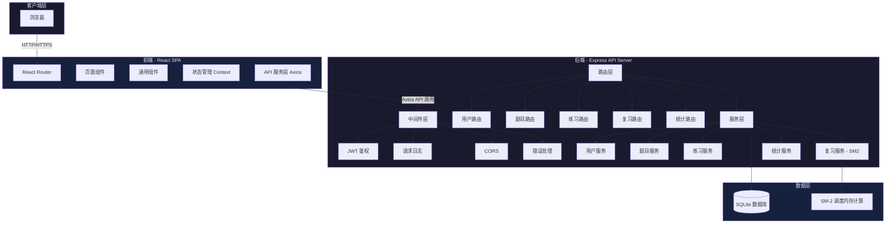
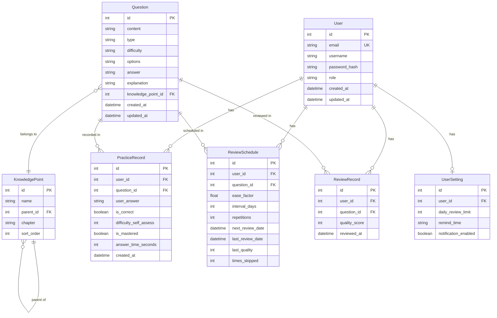
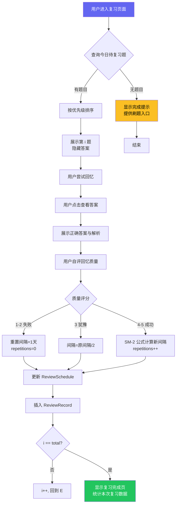
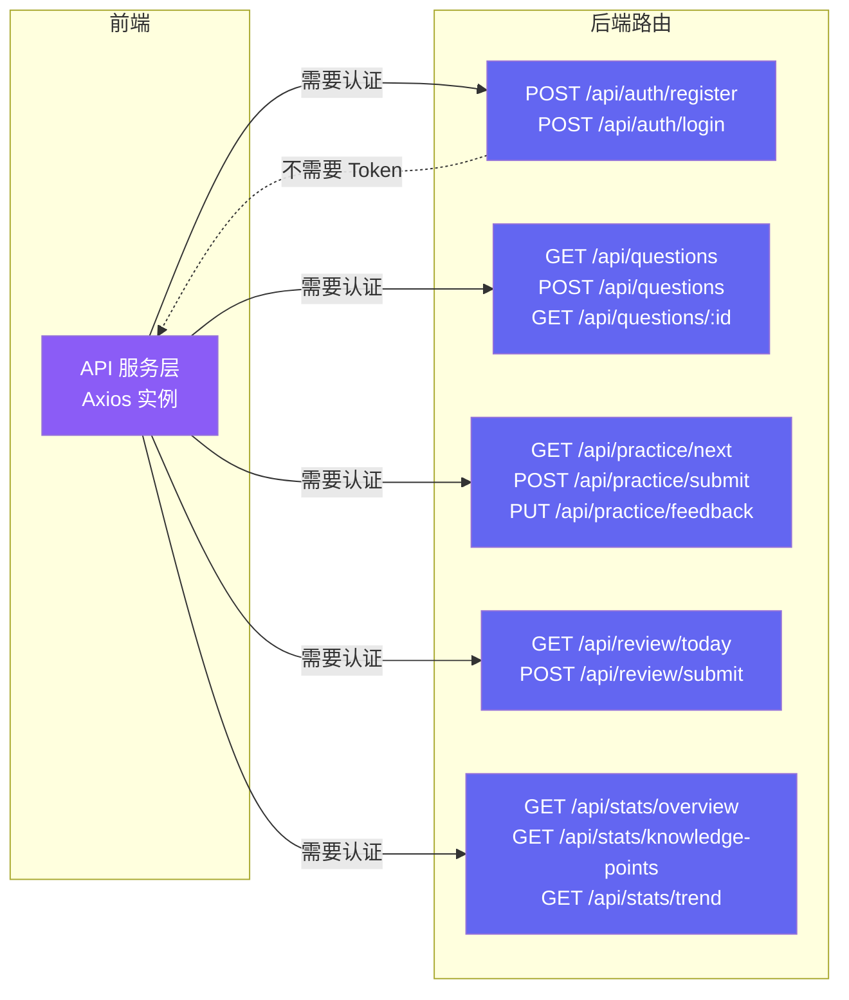

# 设计图与设计说明

## 图 1：系统架构图

### Mermaid 源码



### 设计说明

**这张图表达了什么**：系统的三层架构——客户端（浏览器）、前端 SPA、后端 API 服务、数据层。箭头表示请求/响应的数据流方向。前端层细分为路由、页面组件、状态管理、API 服务四个子模块；后端层按中间件、路由、服务三层组织。

**为什么这样设计**：前后端分离架构是当前 Web 应用的主流模式。前端专注 UI 交互，后端专注业务逻辑和数据，职责清晰。选择分层而不是微服务，是因为项目规模小，单体架构开发效率更高，部署更简单。曾考虑过 Next.js 全栈一体化方案，但该方案的 API Routes 在复杂业务场景下不如 Express 灵活，且 SSR 对本项目收益不大。

**局限性**：该架构没有做服务容错设计（熔断、重试），也未引入缓存层。如果后续用户量增长，SQLite 的写锁可能成为瓶颈，需要升级到 PostgreSQL 并增加 Redis 缓存层。

---

## 图 2：ER 图 / 数据模型

### Mermaid 源码



### 设计说明

**这张图表达了什么**：系统核心数据模型，包含 7 个实体及其关系。User 是所有业务记录的起点，Question 通过 KnowledgePoint 组织分类，PracticeRecord / ReviewSchedule / ReviewRecord 分别记录答题、复习调度、复习操作三类业务数据。

**为什么这样设计**：
- 将复习调度（ReviewSchedule）和复习记录（ReviewRecord）与答题记录（PracticeRecord）分离，因为复习和刷题是不同业务场景，数据结构不同。复习调度关心 SM-2 算法参数（ease_factor、interval_days、repetitions），而答题记录关心用户答案和正确性。
- KnowledgePoint 使用 parent_id 自引用实现树形结构（邻接表模式），简单直接，适合层级不超过 5 层的知识点体系。更复杂的方案（如闭包表、物化路径）对当前项目过度设计。

**被放弃的方案**：
- **统一存为一张"学习记录"表**：放弃，因为答题和复习的字段差异大，混在一起会有大量 NULL 字段，且查询需要加 type 区分，增加复杂度。
- **使用 MongoDB**：放弃，因为数据关系明确（用户→答题→复习），关系型数据库更自然。SQLite 零配置的优势对个人项目很重要。

**局限性**：邻接表模式查询子树需要递归，SQLite 的递归 CTE 性能在深层级时下降。如果知识点树超过 5 层，建议改用物化路径或闭包表。

---

## 图 3：界面原型 — 线框图

### 文本描述的界面原型

#### 3.1 刷题页面线框图

```
┌──────────────────────────────────────────────────────────────┐
│  🔢 考研数学刷题系统     [题库] [刷题] [复习] [数据] [设置] │
├──────────────────────────────────────────────────────────────┤
│  模式: [顺序练习 ▼]  知识点: [全部 ▼]                       │
│  进度: ████████░░░░░░░░░░ 12/30                             │
├──────────────────────────────────────────────────────────────┤
│                                                              │
│  第 13 题 / 共 30 题                   难度: ★★★☆☆         │
│                                                              │
│  ┌──────────────────────────────────────────────────────┐    │
│  │  已知函数 f(x) 在 [0,1] 上连续，在 (0,1) 内可导，    │    │
│  │  且 f(0)=0，f(1)=1。证明：存在 ξ∈(0,1)，使得        │    │
│  │  f'(ξ) = 1。                                        │    │
│  │                                                      │    │
│  │  知识点：微分中值定理   |  来自：真题 2023            │    │
│  └──────────────────────────────────────────────────────┘    │
│                                                              │
│  ┌──────────────────────────────────────────────────────┐    │
│  │  [✏️ 输入你的答案...]                                │    │
│  └──────────────────────────────────────────────────────┘    │
│                                                              │
│           [提交答案]    [跳过]    [☆ 收藏]                   │
│                                                              │
└──────────────────────────────────────────────────────────────┘

┌──── 提交后展开 ────┐
│  ✅ 正确！          │
│  ───────────────── │
│  解析：由拉格朗日   │
│  中值定理...        │
│                    │
│  自评难度：[简单] [适中] [困难]                             │
│  掌握状态：[已掌握] [还需练习]                               │
│                    │
│      [下一题 →]    │
└────────────────────┘
```

#### 3.2 复习页面线框图

```
┌──────────────────────────────────────────────────────────────┐
│  🔢 考研数学刷题系统     [题库] [刷题] [复习] [数据] [设置] │
├──────────────────────────────────────────────────────────────┤
│                                                              │
│  📅 今日复习                                    剩余 8 题    │
│                                                              │
│  ┌──────────────────────────────────────────────────────┐    │
│  │                                                      │    │
│  │  设 A 为 3 阶矩阵，|A| = 2，求 |2A^{-1} + A*|       │    │
│  │                                                      │    │
│  │  ─────────────────────────────────────────           │    │
│  │                                                      │    │
│  │  试着回忆这道题的解法，想好后点击下方按钮查看答案     │    │
│  │                                                      │    │
│  │              [📖 查看答案]                            │    │
│  │                                                      │    │
│  └──────────────────────────────────────────────────────┘    │
│                                                              │
│  回忆质量自评：                                              │
│  [❶完全忘记] [❷困难] [❸犹豫] [❹轻松] [❺完美]              │
│                                                              │
├──────────────────────────────────────────────────────────────┤
│  复习进度：████████░░░░░░░░░░░░░░░░░░░ 8/30                  │
└──────────────────────────────────────────────────────────────┘
```

#### 3.3 数据分析页面线框图

```
┌──────────────────────────────────────────────────────────────┐
│  🔢 考研数学刷题系统     [题库] [刷题] [复习] [数据] [设置] │
├──────────────────────────────────────────────────────────────┤
│                                                              │
│  📊 今日概览                                                 │
│  ┌────────┐ ┌────────┐ ┌────────┐ ┌────────┐               │
│  │  做题   │ │  正确   │ │  正确率 │ │  时长   │               │
│  │   24    │ │   18    │ │  75%   │ │ 45min  │               │
│  │  今日   │ │  今日   │ │  今日   │ │  今日   │               │
│  └────────┘ └────────┘ └────────┘ └────────┘               │
│                                                              │
│  [正确率趋势] [薄弱知识点] [学习进度]                         │
│                                                              │
│  ┌──────────────────────────────────────────────────────┐    │
│  │ 正确率趋势（过去 30 天）                              │    │
│  │                                                      │    │
│  │  100% ┤                                              │    │
│  │   80% ┤        ╱╲    ╱╲                              │    │
│  │   60% ┤  ╱╲  ╱  ╲  ╱  ╲    ╱╲                        │    │
│  │   40% ┤ ╱  ╲╱    ╲╱    ╲  ╱  ╲                       │    │
│  │   20% ┤╱                  ╲╱    ╲                     │    │
│  │    0% ┤─────────────────────────────                  │    │
│  │       6/1  6/6  6/11  6/16  6/21  6/26                │    │
│  └──────────────────────────────────────────────────────┘    │
│                                                              │
│  薄弱知识点（正确率 < 60%）                                   │
│  ┌──────────────────────────────────────────────────────┐    │
│  │  🔴 向量组线性相关        正确率 35%  [专项训练 →]  │    │
│  │  🟡 微分中值定理          正确率 42%  [专项训练 →]  │    │
│  │  🟢 概率分布函数          正确率 55%  [专项训练 →]  │    │
│  └──────────────────────────────────────────────────────┘    │
└──────────────────────────────────────────────────────────────┘
```

### 设计说明

**刷题页面设计说明**（第 3.1 张图）
- **这张图表达了什么**：系统的核心交互页面——学生在此完成做题练习。包含模式选择、题目展示、答案输入、提交反馈四个区域。
- **为什么这样设计**：题目区和答题区分开，避免误触。提交后即时反馈（对/错 + 解析），符合"做题→反馈→学习"的学习闭环。进度条给用户掌控感。
- **交互细节**：提交后展开解析面板，用户自评难度和掌握状态后自动加载下一题。考试模式下隐藏"跳过"按钮和实时反馈。
- **局限性**：解答题的输入方式（公式编辑）尚未在本设计中解决。初步方案：集成 KaTeX 公式编辑器或拍照上传。

**复习页面设计说明**（第 3.2 张图）
- **这张图表达了什么**：SM-2 间隔复习的执行页面——用户在此完成每日复习任务。
- **为什么这样设计**：核心设计理念是"回忆优先"。题目先展示不显示答案，迫使用户主动回忆，这是间隔重复有效的关键。5 级评分按钮用大按钮设计，减少误操作。
- **被放弃的方案**：滑动条评分（1-5 拖拽）——精度虽高但交互成本大，按钮点击更直接。
- **局限性**：目前不区分"复习"和"学习"（首次学习的题目也会进入调度），后续可增加"学习模式"。

**数据分析页面设计说明**（第 3.3 张图）
- **这张图表达了什么**：学习数据的可视化展示，包括今日概览、正确率趋势、薄弱知识点。
- **为什么这样设计**：顶部概览卡给用户即时反馈，图表区提供深度分析。薄弱知识点用红/黄/绿颜色编码，一目了然。"专项训练"按钮将数据分析直接连接到行动，形成"发现薄弱→立即训练"的闭环。
- **被放弃的方案**：全部数据堆在一个页面——信息密度太高，用户认知负担重。改为 Tab 切换，每个视图聚焦一个维度。
- **局限性**：图表交互功能有限（仅悬停显示数据），不支持钻取下钻（点击某天查看当天的详细答题列表）。

---

## 图 4：核心流程设计 — SM-2 间隔复习流程图

### Mermaid 源码



### 设计说明

**这张图表达了什么**：SM-2 间隔复习算法的完整执行流程，从进入复习页面到完成全部复习任务。核心是"回忆 → 确认 → 自评 → 算法更新"四个步骤。

**为什么这样设计**：
- 将"查看答案"设计为用户主动操作（点击按钮）而非自动展示，确保用户先尝试回忆再看到答案，这是间隔重复有效性的关键。
- 三种评分结果走不同的算法路径：失败重置、犹豫减半、成功递进。这是 SM-2 算法的标准实现。
- 使用 ReviewSchedule（调度参数）和 ReviewRecord（历史记录）两张表，职责分离。

**与 Anki 的差异说明**：
| 维度 | Anki | 本系统 |
|------|------|--------|
| 评分等级 | 4 级（Again/Hard/Good/Easy） | 5 级（完全忘记~完美） |
| 失败策略 | 间隔重置 + 移入学习队列 | 间隔重置为 1 天 |
| 跳过策略 | 不支持跳过 | 支持跳过，不更新参数 |
| UI 设计 | 先显示答案后评分 | 先回忆后看答案再评分 |

**局限性**：SM-2 算法假设用户的记忆规律是稳定的，但实际上考研备考期间记忆效率会随时间变化（考前冲刺期效率更高）。未来可考虑引入 FSRS（Free Spaced Repetition Scheduler）算法，它基于深度学习更准确地预测记忆状态。

---

## 图 5：接口概览图

### Mermaid 源码



### 设计说明

**这张图表达了什么**：前后端 API 的完整映射。前端通过统一的 Axios 实例向后端发送 HTTP 请求，后端按资源组织路由。

**为什么这样设计**：RESTful API 设计风格，每个资源对应一组路由。认证接口（/auth）不需要 Token，其他接口都需要在 Header 中携带 `Authorization: Bearer <token>`。统一的前端 API 层可以在 Axios 拦截器中统一处理 Token 注入、错误响应、请求重试等横切关注点。

**接口设计原则**：
1. 统一响应格式：`{code, data, message}`
2. 统一错误格式：`{code: 4xx/5xx, message: "错误描述"}`
3. 分页参数标准化：`?page=1&limit=20`，响应包含 `total` 字段
4. 版本前缀（预留）：`/api/v1/...`

**局限性**：当前设计未考虑接口限流（Rate Limiting）和请求缓存。如果接口被频繁调用（如刷题时连续 GET /practice/next），建议增加 Redis 缓存或本地缓存策略。
