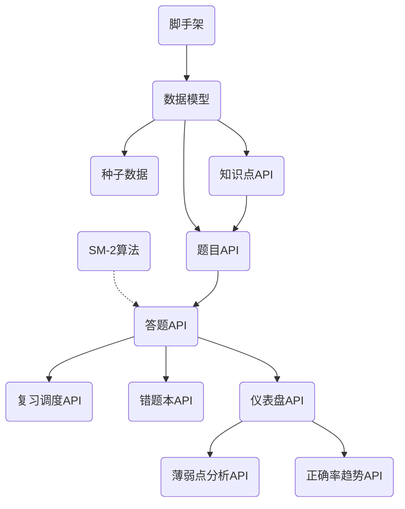

# 考研数学刷题系统 — MVP 编码计划

## 1. MVP 功能模块清单

| 编号 | 模块 | 功能 | 优先级 | 依赖 |
|:----:|------|------|:------:|:----:|
| M1 | 项目脚手架 | 目录结构、依赖安装、配置 | P0 | — |
| M2 | 数据模型 | 数据库表结构定义 | P0 | M1 |
| M3 | SM-2 算法 | 间隔重复核心算法 | P0 | — |
| M4 | 种子数据 | 示例知识点和题目 | P0 | M2 |
| M5 | 知识点 API | CRUD 知识点 | P0 | M2 |
| M6 | 题目 API | CRUD 题目（含筛选） | P0 | M2, M5 |
| M7 | 答题 API | 提交答案、判对错、SM-2 更新 | P0 | M2, M3, M6 |
| M8 | 复习调度 API | 获取今日待复习题目 | P0 | M2, M7 |
| M9 | 错题本 API | 获取答错过的题目 | P1 | M2, M7 |
| M10 | 仪表盘 API | 总览数据、每日统计 | P1 | M2, M7 |
| M11 | 薄弱点分析 API | 知识点掌握度分析 | P1 | M2, M7 |
| M12 | 正确率趋势 API | 历史正确率数据 | P1 | M2, M7 |

## 2. 模块依赖关系与编码顺序

### 推荐编码顺序

| 顺序 | 模块 | 预估对话轮数 | 验证方式 |
|:----:|------|:----------:|---------|
| 1 | M1 项目脚手架 | 1 轮 | `python main.py` 启动无报错 |
| 2 | M2 数据模型 | 1 轮 | 创建表成功 |
| 3 | M3 SM-2 算法 | 1 轮 | `python sm2.py` 演示运行 |
| 4 | M4 种子数据 | 1 轮 | 数据库中有 9 个知识点 + 15 道题 |
| 5 | M5 知识点 API | 1 轮 | `GET /api/knowledge-points` 返回数据 |
| 6 | M6 题目 API | 1 轮 | `GET /api/questions` 返回数据 |
| 7 | M7 答题 API | 2 轮 | `POST /api/answer` 正误判断正确 |
| 8 | M8 复习调度 API | 1 轮 | `GET /api/review/due` 返回待复习列表 |
| 9 | M9 错题本 API | 1 轮 | `GET /api/error-book` 返回错题 |
| 10 | M10 仪表盘 API | 1 轮 | `GET /api/dashboard` 返回统计数据 |
| 11 | M11 薄弱点分析 API | 1 轮 | `GET /api/analysis/weak-points` 返回分析 |
| 12 | M12 正确率趋势 API | 1 轮 | `GET /api/stats/correct-rate-trend` 返回趋势数据 |

## 3. 任务拆分明细

### 子任务 1：项目脚手架
- 初始化 FastAPI 项目结构
- 安装依赖：fastapi, uvicorn, sqlalchemy, pydantic
- 创建目录：backend/
- 配置文件：requirements.txt

### 子任务 2：数据模型
- 定义 KnowledgePoint（知识点）
- 定义 Question（题目）
- 定义 AnswerRecord（答题记录）
- 定义 ReviewSchedule（复习调度）
- 配置 SQLite 连接

### 子任务 3：SM-2 算法
- 实现质量评分计算函数
- 实现间隔更新算法
- 提供演示脚本

### 子任务 4：种子数据
- 填充高等数学知识点（极限、导数、积分等）
- 填充线性代数知识点（行列式、矩阵等）
- 填充概率统计知识点
- 创建 15 道示例题目

### 子任务 5：知识点 API
- 列出所有知识点（支持分类筛选）

### 子任务 6：题目 API
- 列出题目（支持知识点、难度、分类筛选）
- 获取单题详情

### 子任务 7：答题 API（核心）
- 接收答案 → 判断正误 → 记录答题 → SM-2 更新 → 返回解析

### 子任务 8：复习调度 API
- 获取今日待复习题目列表

### 子任务 9：错题本 API
- 获取所有答错过的题目（去重）

### 子任务 10：仪表盘 API
- 今日概览（做题数、正确率、待复习数）
- 每日统计（最近 14 天）
- 知识点统计

### 子任务 11：薄弱点分析 API
- 按知识点聚合正确率
- 掌握等级判定

### 子任务 12：正确率趋势 API
- 日正确率趋势数据
